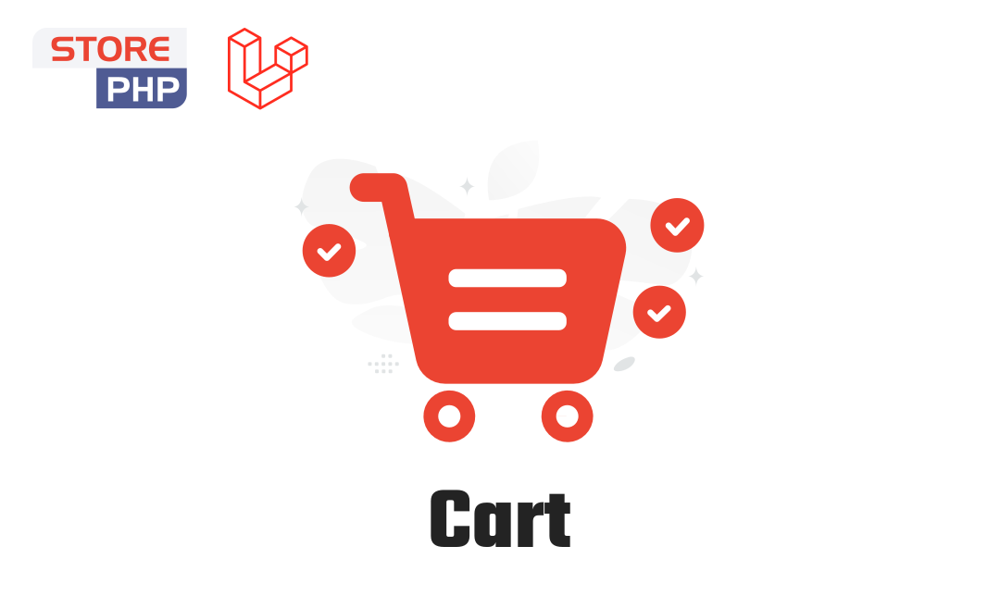

# Basketin Cart

Laravel cart library for e-commerce. Provides carts, quotes (line items), totals, coupons, custom fields, and order preparation with a clean API.

Documentation: https://obelaw.com/docs/basketin/introduction